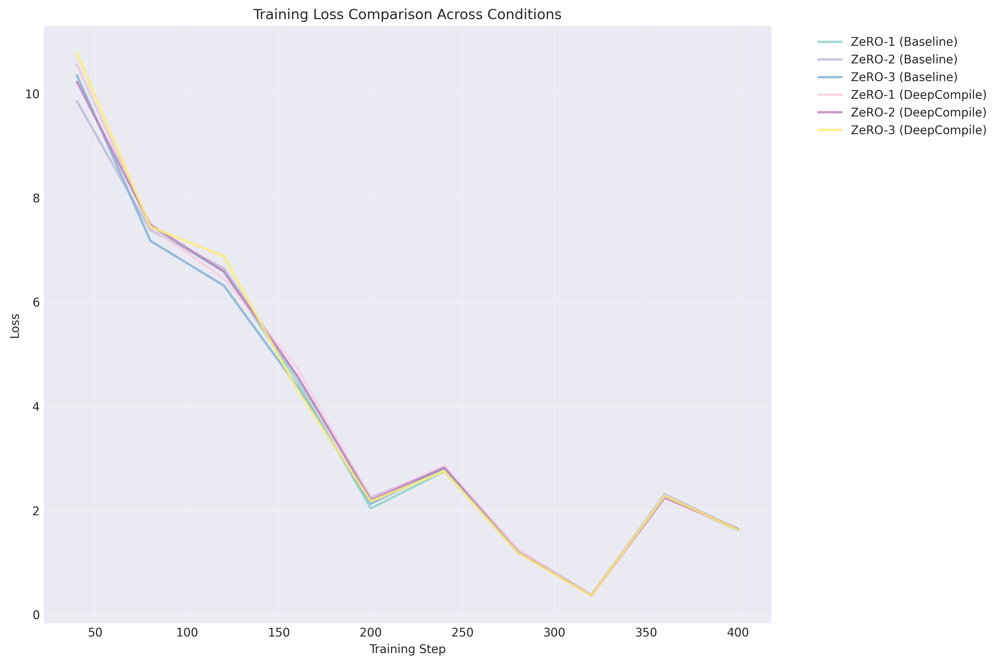
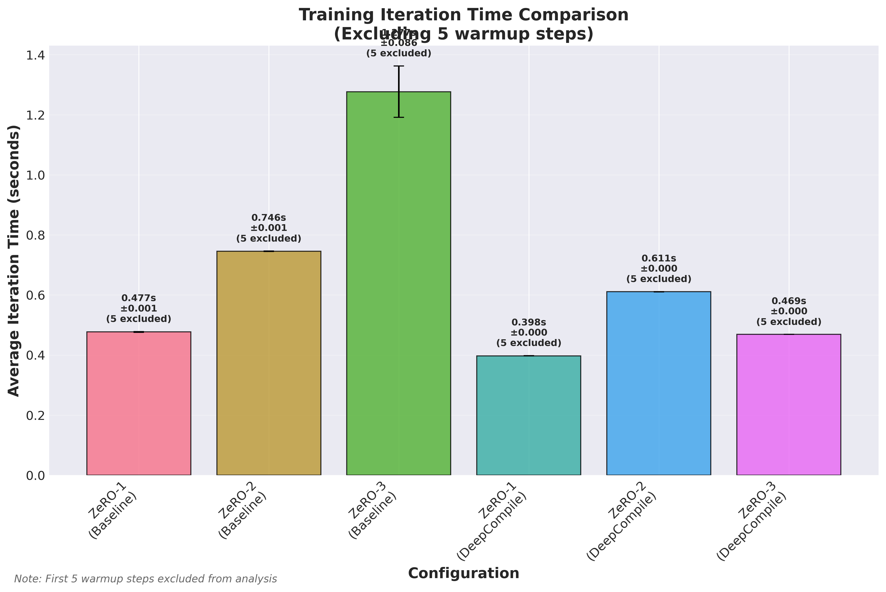
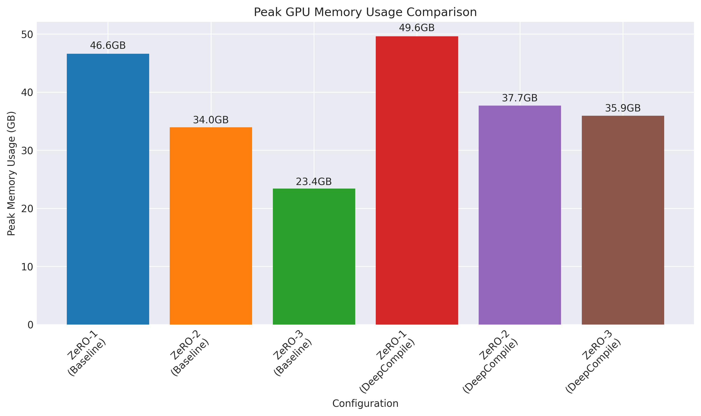

# DeepSpeed Loss Verification Experiment Report

**Generated:** 2025-06-17T04:31:10+00:00

## Executive Summary

This report presents the results of a comprehensive comparison between different DeepSpeed ZeRO stages with and without DeepCompile optimization. The experiments evaluate:

- Training loss convergence across different configurations
- Iteration time performance
- Memory usage efficiency

## Experimental Setup

### Test Conditions

| Condition | Configuration | Status |
|-----------|---------------|--------|
| z1_baseline | ZeRO-1 + Baseline | ✅ Success |
| z2_baseline | ZeRO-2 + Baseline | ✅ Success |
| z3_baseline | ZeRO-3 + Baseline | ✅ Success |
| z1_deepcompile | ZeRO-1 + DeepCompile | ✅ Success |
| z2_deepcompile | ZeRO-2 + DeepCompile | ✅ Success |
| z3_deepcompile | ZeRO-3 + DeepCompile | ✅ Success |

### Model and Training Parameters

- **Model:** meta-llama/Meta-Llama-3-8B
- **Dataset:** WikiText (20% subset)
- **Batch Size:** 1 per GPU
- **Gradient Accumulation Steps:** 4
- **Sequence Length:** 512
- **Epochs:** 5
- **Warmup Steps Excluded:** 5 (for timing analysis)

## Results

### Loss Convergence Analysis

**Key Findings:**

- **ZeRO-1 (Baseline):** Final loss: 1.620094, Best loss: 0.363938
- **ZeRO-2 (Baseline):** Final loss: 1.637939, Best loss: 0.375859
- **ZeRO-3 (Baseline):** Final loss: 1.639387, Best loss: 0.365377
- **ZeRO-1 (DeepCompile):** Final loss: 1.630608, Best loss: 0.357352
- **ZeRO-2 (DeepCompile):** Final loss: 1.644009, Best loss: 0.373132
- **ZeRO-3 (DeepCompile):** Final loss: 1.628428, Best loss: 0.367286

### Performance Analysis

**Performance Summary** *(excluding first 5 warmup steps)*:

| Configuration | Avg. Iteration Time | Std. Dev | Steps Used |
|---------------|--------------------|---------|-----------|
| ZeRO-1 (Baseline) | 0.477s | 0.001s | 5/10 |
| ZeRO-2 (Baseline) | 0.746s | 0.001s | 5/10 |
| ZeRO-3 (Baseline) | 1.277s | 0.086s | 5/10 |
| ZeRO-1 (DeepCompile) | 0.398s | 0.000s | 5/10 |
| ZeRO-2 (DeepCompile) | 0.611s | 0.000s | 5/10 |
| ZeRO-3 (DeepCompile) | 0.469s | 0.000s | 5/10 |

### Memory Usage Analysis

## Data Quality Assessment

| Condition | Loss Data Points | Timing Data Points | Memory Data Points |
|-----------|------------------|--------------------|-----------------|
| ZeRO-1 (Baseline) | 10 | 10 | 10 |
| ZeRO-2 (Baseline) | 10 | 10 | 10 |
| ZeRO-3 (Baseline) | 10 | 10 | 10 |
| ZeRO-1 (DeepCompile) | 10 | 10 | 10 |
| ZeRO-2 (DeepCompile) | 10 | 10 | 10 |
| ZeRO-3 (DeepCompile) | 10 | 10 | 10 |

## Recommendations

Based on the experimental results:

- **Fastest Configuration:** ZeRO-1 (DeepCompile) with 0.398s average iteration time
- **Best Loss Convergence:** ZeRO-1 (DeepCompile) with minimum loss of 0.357352

## Appendix

### Wandb Run IDs

### Log Files

Detailed logs for each condition are available in the results directory:

- `z1_baseline_detailed.log`
- `z2_baseline_detailed.log`
- `z3_baseline_detailed.log`
- `z1_deepcompile_detailed.log`
- `z2_deepcompile_detailed.log`
- `z3_deepcompile_detailed.log`
